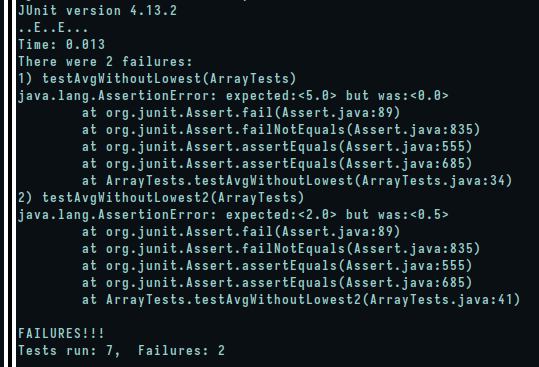

## Lab 2 - String Web Server, Bugs and Reflection

## Part 1

```java
import java.io.IOException;
import java.net.URI;
import java.util.ArrayList;
class Handler implements URLHandler {
    // The one bit of state on the server: a number that will be manipulated by
    // various requests.
    ArrayList<String> strList = new ArrayList<>();

    public String handleRequest(URI url) {
        String s = new String();

        if (url.getPath().equals("/")) {
            for (int i=1; i < strList.size(); i++) {
                s += strList.get(i);
            }
            s += url.getPath();
            return s;
        } else {

            if (url.getPath().contains("/add-messages")) {
                String[] parameters = url.getQuery().split("=");
                if (parameters[0].equals("s")) {
                    strList.add("\n" + parameters[1]);

                    for (int i = 0; i < strList.size(); i++) {
                        s += strList.get(i);
                    }

                    s += "\n" + url.getPath();
                }

                return s;
            }

	    }

        return "404 Not Found!";
    }
}

class StringServer {
    public static void main(String[] args) throws IOException {
        if(args.length == 0){
            System.out.println("Missing port number! Try any number between 1024 to 49151");
            return;
        }

        int port = Integer.parseInt(args[0]);

        Server.start(port, new Handler());
    }
}
```


When the main method in StringServer is called, we call `Server.start()` to start up the web server, in Server we create an HttpServer object called "server" which calls a `create()` method to make a socket address using the port provided. 

Then it proceeds to create a request entrypoint using the created HttpServer object using the following statement:

`server.createContext()`

We then proceed to actually start the server process by the following:

`server.start()`

Where `start()` is a method defined in HttpsServer

Once we make a request to the server by visiting the url associated with it the following method is called:

`public String handleRequest(URI url)`

where the url we visited is passed down to it.

Specifically looking into this method we can see that url.getPath() returns the decoded portion of the path url which is essentially everything in the url after the domain name and before the query.

So this would return a string with either just "/" or "/add-messages"

The relevant arguments would essentially be the URI object itself which contains the methods needed to essentially split the whole url into the essential portions using either the `getPath()` method or the `getQuery()` method.

The values changed in this class would essentially be at the point where the query is split into its two components, specifically e.g. "s=hello" where using the `url.getQuery().split("=") gives us a String array of size two that has the following elements:

["s", "hello"]

The first element would always be the same since it is our parameter which we are checking for new strings.

The second element would change if we were to specify something different.

In essence our URI objects gets changed since the query would be different, but so would the String array used when splitting it.

We also have our instance variable "strList" that would be changed by the addition of new strings as well as the "String s" variable we are using to store the added strings to return back to the HttpServer and be rendered on the page.

## Part 2

For the method `averageWithoutLowest` in ArrayExamples.java, a bug in the program was that when we input an array of elements such that there are a lot more lower elements that are similar than there are higher elements, we get an error in the average.

For example:

[1, 1, 1, 1, 2]

Would produce an average of 0.5, although this method is supposed to return back 2 since we are simply ignoring the lowest element, which is 1 in this case.

So writing the following JUnit test:

```java
@Test
public void testAvgWithoutLowest2() {
  double[] arr = {1.0, 1.0, 1.0, 1.0, 2.0};
  assertEquals(2.0, ArrayExamples.averageWithoutLowest(arr), 0.0);
}
```

Will produce a failure since we are expecting the double value "2.0" to be returned back from `averageWithoutLowest()`

```java
  @Test
  public void testAvgWithoutLowest3() {
    double[] arr = {1.0, 2.0, 3.0, 4.0, 5.0};
    assertEquals(3.5, ArrayExamples.averageWithoutLowest(arr), 0.0);
  }
```

The above test should pass since the first element is the lowest and gets filtered out correctly, thus giving us an average of 3.5.

Once we have ran the tests, we get the following failures (**symptoms**), most importantly `testAvgWithoutLowest2()` failed and `testAvgWithoutLowest3()` passed.



We can see the following code block shows the bug in the return statement in the last line `return sum / (arr.length - 1)`, rather than dividing by `arr.length - 1` we can keep a count of how many elements we are actually summing.

Before bug fix:

```java
static double averageWithoutLowest(double[] arr) {
  if(arr.length < 2) { return 0.0; }
  double lowest = arr[0];
  for(double num: arr) {
    if(num < lowest) { lowest = num; }
  }
  double sum = 0;
  for(double num: arr) {
    if(num != lowest) { sum += num; }
  }
  return sum / (arr.length - 1);
}
```

After bug fix:

```java
static double averageWithoutLowest(double[] arr) {
  if(arr.length < 2) { return 0.0; }
  double lowest = arr[0];
  for(double num: arr) {
    if(num < lowest) { lowest = num; }
  }
  double sum = 0;
  int count = 0;
  for(double num: arr) {
    if(num != lowest) {
      sum += num;
      count++;
    }
  }
  return sum / count;
}
```

This should now return the average once we have multiple elements that are the lowest (which shouldn't be counted in the first place)

## Part 3

The introduction of the URLHandler interface is a pretty interesting one since it facilitates what we can do with URLs and manipulate them by filtering out information from them such as when we use queries and then use the `String.split()` method. This allows the processing of data from other users that visit the url. Also the fact that as long as the server is active the data is persistent, meaning that it is stored somewhere in memory which is essentially like having another "application" running on your computer except this application is a web server.


