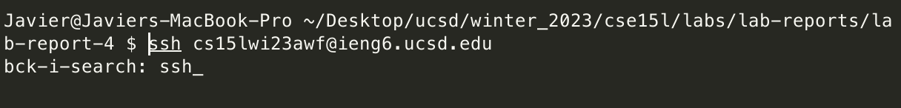
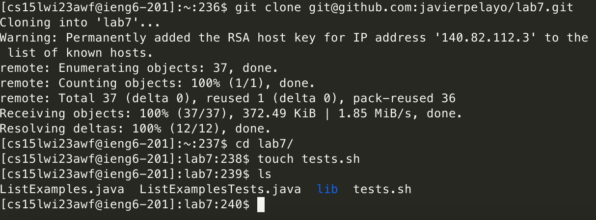
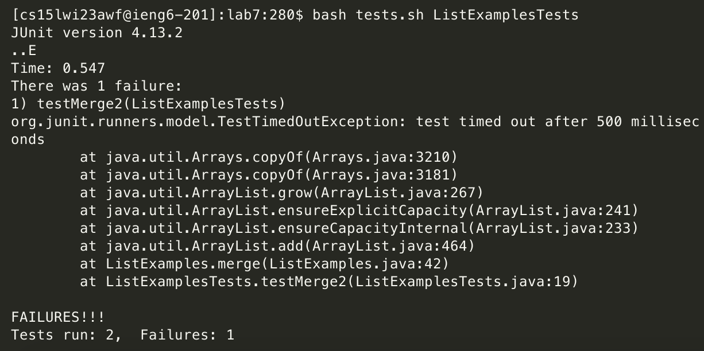
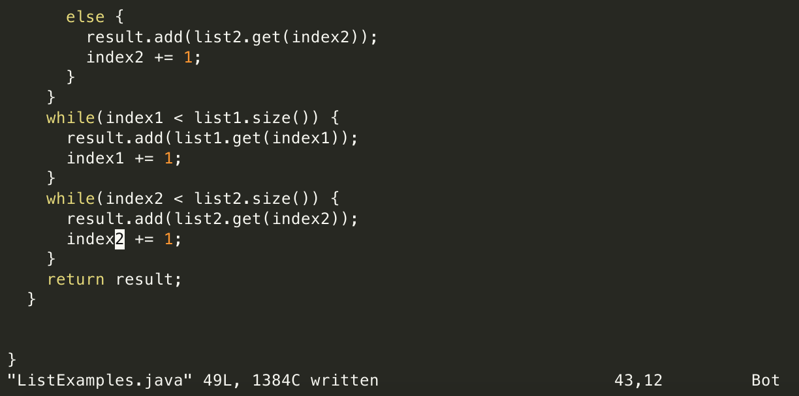
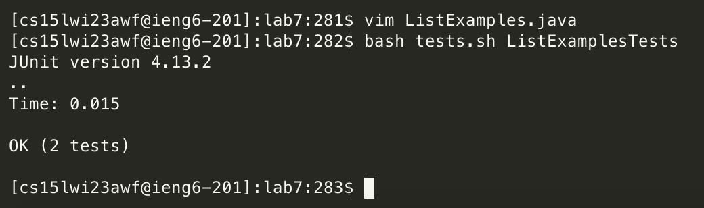
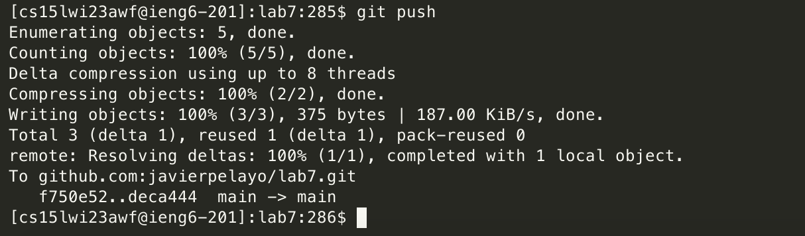

First do the following:

- Setup Delete any existing forks of the repository you have on your account
- Setup Fork the repository
- The real deal Start the timer!

# The following will be step-by-step

# Log into ieng6

In the terminal do 

```
<CTRL+r> ssh <ENTER>
```

The first suggestion was "ssh cs15lwi23awf@ieng6.ucsd.edu" for me which proceeded to connect me to the ieng6 server after pressing enter.



# Clone your fork of the repository from your Github account

```
git clone git@github.com:javierpelayo/lab7.git<ENTER>
cd l<TAB> which autocompletes to "cd lab7" <ENTER>
touch tests.sh<ENTER>
ls<ENTER>
```



# Run the tests, demonstrating that they fail

```
vim tests.sh
<i> for insert mode
```

I then typed the following into the script file:

```
javac -cp .:lib/junit-4.13.2.jar:lib/hamcrest-core-1.3.jar:. $1.java
<yy>
```

Copies the line that the cursor is at, then `<p>` paste whats in clipboard one line below the cursor, then `<x>` to delete a character, in this case I deleted the "c" from "javac", then `<SHIFT+s>` to move cursor to the end of the line, then `<SHIFT+b>` to move cursor at the start of "$1.java", then `<ll>` to move the cursor to be at the ".", then `<xxxxx>` to delete ".java", then `<SHIFT+b>`, then `<i>` for insert mode again, then I typed "org.junit.runner.JUnitCore "

So I now have the following:

```
java -cp .:lib/junit-4.13.2.jar:lib/hamcrest-core-1.3.jar:. org.junit.runner.JUnitCore $1
<ESCAPE>
```

The last line is to return to normal mode, in this case I have Escape mapped to my Caps lock key for easier access since I have trouble reaching the Escape key, then I did:

```
<:wq> <Enter>
```

Which exits the file while saving, then I did:

```
bash tests.sh ListExamplesT<TAB><BACKSPACEx5><ENTER>
```

Which output the following:



# Edit the code file to fix the failing test

From the above I can see that the issue comes from the merge method in ListExamples.java, and it gives me the line number: 42, so I do the following:

```
vim ListExamples.java
<42><SHIFT+g>
```
where the last line causes our cursor to jump to that line number.

Now the issue was that we were updating index1 rather than index2, so hit `<r>` to replace the 1 and then type 2 and then `<:wq>` to quit and save.



# Run the tests, demonstrating that they now succeed

In the terminal I do:

```
<up><up>
bash tests.sh ListExamplesTests<ENTER>
```

Which outputs the correct result as shown:



# Commit and push the resulting change to your Github account (you can pick any commit message!)

Since the tests have passed I then do:

```
git add ListExamples.java<ENTER>
git commit -m "Fix ListExamples.java"<ENTER>
git push<ENTER>
```




