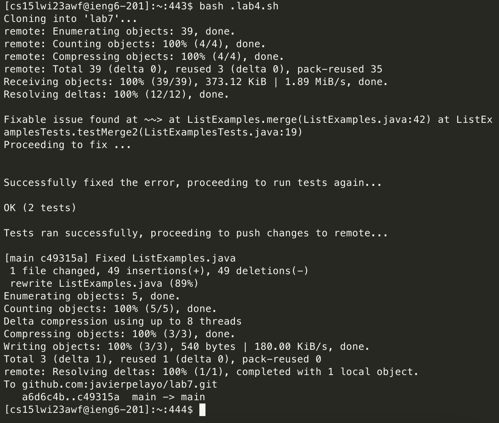

## One liner for fixing Lab 4

# First we're going to want to ssh into the remote server:

```
ssh cs15lwi23awf@ieng6.ucsd.edu
```

# We can now run the scripts:

We first need to make a script called `tests.sh` which will contain the following to run the junit tests on our files:

```
javac -cp .:lib/junit-4.13.2.jar:./lib/hamcrest-core-1.3.jar:. $1.java
java -cp .:lib/junit-4.13.2.jar:./lib/hamcrest-core-1.3.jar:. org.junit.runner.JUnitCore $1
```

The following will be `lab4.sh` which will contain everything that will help us fix the issue with lab7.

```
rm -rf lab7

git clone git@github.com:javierpelayo/lab7.git

cd lab7

cp ../scripts/tests.sh .

bash tests.sh ListExamplesTests > output-log.txt

OUTPUT=`grep "at ListExamples*" output-log.txt`

if [[ $? -gt 0 ]]  
then
    echo "No issues were found."
else
    echo " "
    echo "Fixable issue found at ~~>" $OUTPUT
    echo "Proceeding to fix ..."
    echo " "
fi

mv ListExamples.java ListExamples2.java
touch ListExamples.java

B4FIX="index1 += 1;"	
FIXEDLINE="index2 += 1;"	
let CNT=0
cat ListExamples2.java | while read LINE
do
    if [[ $LINE == $B4FIX && $CNT -eq 42 ]]
    then
	echo " "
    	echo "$FIXEDLINE" >> ListExamples.java
	echo "Successfully fixed the error, proceeding to run tests again..."
	echo " "
    else
	echo "$LINE" >> ListExamples.java
    fi
    let CNT++
done

bash tests.sh ListExamplesTests > output-log.txt

grep "OK" output-log.txt

if [[ $? -eq 0 ]]
then
    echo " "
    echo "Tests ran successfully, proceeding to push changes to remote..."
    echo " "
    git add ListExamples.java
    git commit -m "Fixed ListExamples.java"
    git push
else
    echo " "
    echo "Something went wrong"
    echo " "
fi
 
```

We can now run the following: `bash lab4.sh` which outputs the following:



This shouldn't take longer than 5 seconds to run so if everything went smoothly this is much quicker than the previous five minutes.

## Grading Script

This grading script should allow room for five tests, so students can score a total of 5 points, 1 point for each test passed.

```
CPATH='.:lib/hamcrest-core-1.3.jar:lib/junit-4.13.2.jar'

let TESTCNT=0
rm -rf student-submission
git clone $1 student-submission
echo 'Finished cloning'

# TEST 1

FILE=`find student-submission -name "ListExamples.java" -maxdepth 1`
if [[ -f $FILE ]] && [[ $FILE = *ListExamples.java* ]]
then
    echo 'ListExamples.java file exists.'
    let TESTCNT++
else
    echo "ListExamples.java file does not exist."
    echo "Score: (0/5)"
    exit 1
fi


cd student-submission

cp ../TestListExamples.java .
cp -r ../lib lib

javac -cp .:lib/hamcrest-core-1.3.jar:lib/junit-4.13.2.jar *.java &> ../output-compiler.txt
java -cp .:lib/hamcrest-core-1.3.jar:lib/junit-4.13.2.jar org.junit.runner.JUnitCore TestListExamples &> ../output-runtime.txt

EXIST_METHOD1=`grep -c "static List<String> filter(List<String> list, StringChecker sc)" ListExamples.java`

EXIST_METHOD2=`grep -c "static List<String> merge(List<String> list1, List<String> list2)" ListExamples.java`

cd ..

INFO=`grep -i "ListExamples.java" output-compiler.txt` 
FAIL=`grep -i -c "FAILURE" output-runtime.txt` 
SUCC=`grep -i -c "OK" output-runtime.txt`

# TEST 2

if [[ $EXIST_METHOD1 -gt 0 ]]
then
	echo "Method Signature one is OK!!!"
    let TESTCNT++
else
    echo "Method signature one is WRONG!!!"
    echo "Score: (1/5)"
    exit 1
fi


# TEST 3

if [[ $EXIST_METHOD2 -gt 0 ]]
then
    echo "Method Signature two is OK!!!"
    let TESTCNT++
else
    echo "Method Signature two is WRONG!!!"
    echo "Score: (2/5)"
    exit 1
fi


# TEST 4 and 5

if [[ $INFO ]]
then
    echo $INFO "- COMPILER ERROR!!!"
    echo "Score: (3/5)"
else
    let TESTCNT++
fi

if [[ $FAIL -gt 0 ]]
then
    echo "Test cases failed. - RUNTIME ERROR!!!"
    echo "Score: (4/5)"
elif [[ $SUCC -gt 0 ]]
then
    echo "Test cases succeeded."
    let TESTCNT++
else
    echo "Something went wrong."
    echo "Score: (4/5)"
fi


echo "All tests completed with a score of $TESTCNT/5!"
```


